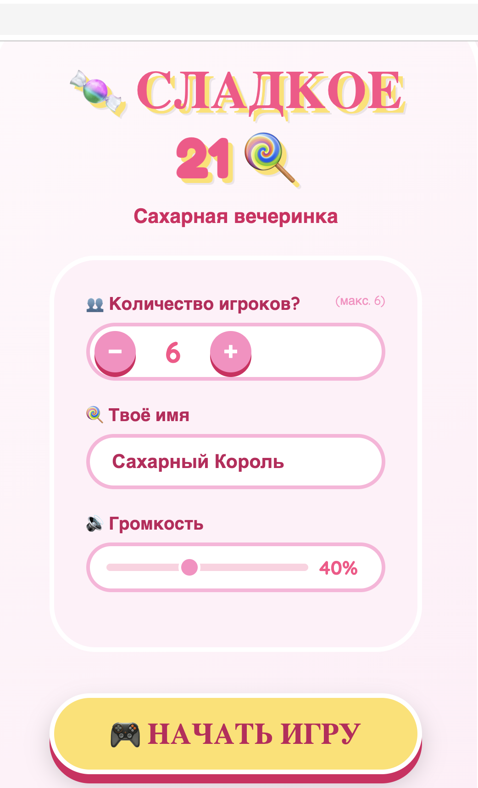
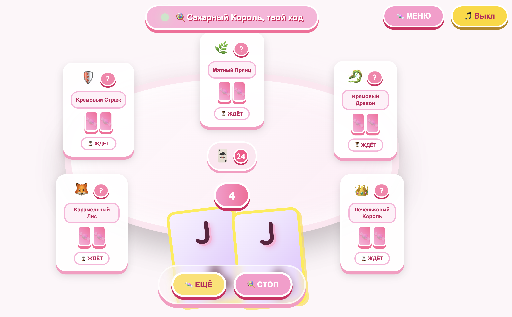
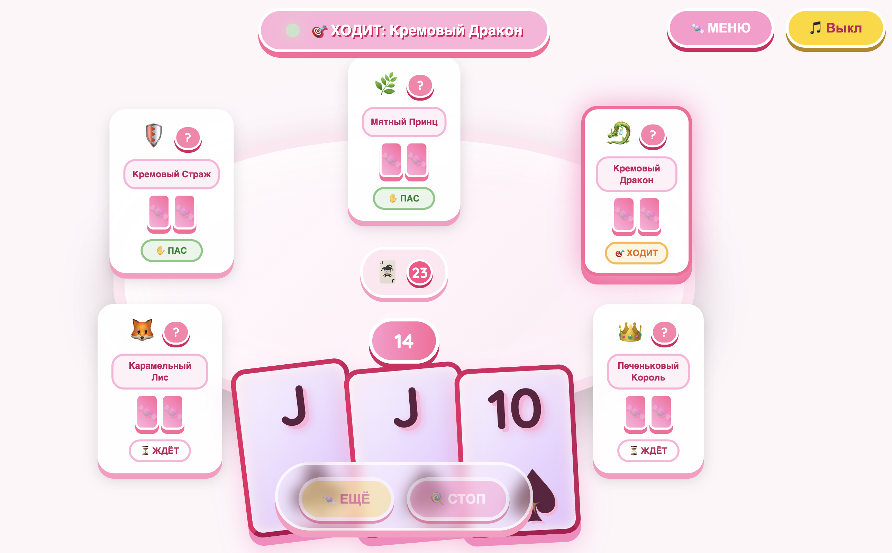
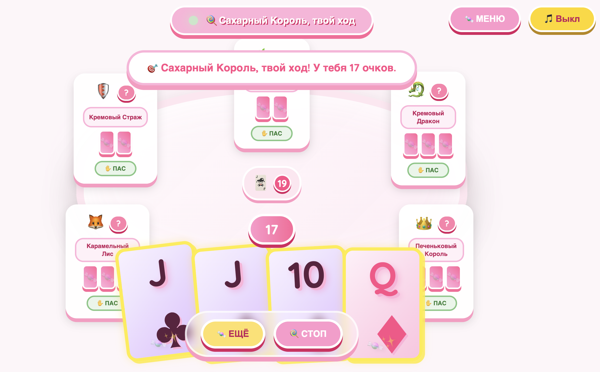
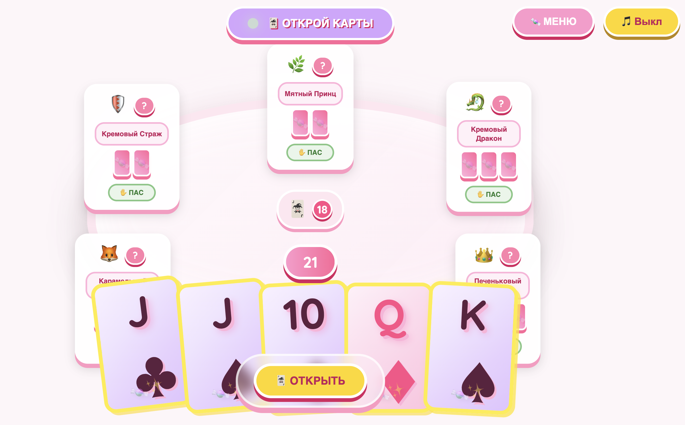
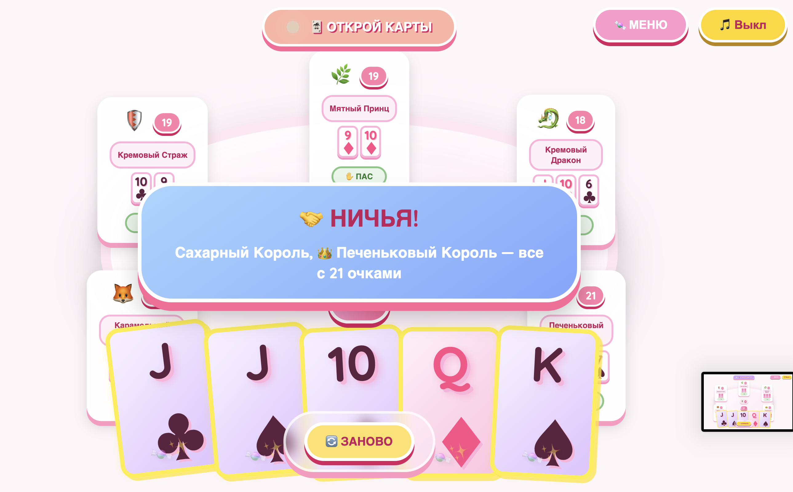

# CandyClubGame
**Сладкое 21 ◦ Карточная вечеринка** — это браузерная карточная игра в стиле **Candy Club**.

Игра доступна по ссылке:
https://tinapav47-ux.github.io/CandyClubGame/
---

##  Описание игры

* Классические правила **21 / Blackjack**
* Милая **candy-эстетика**: розовые цвета, маршмеллоу, конфеты
* Играть в браузере
* Максимум **6 игроков** за столом

Цель игры: **набрать сумму карт как можно ближе к 21, но не больше**.

---

##  Как играть

1. Каждый игрок получает по две карты.
2. На своём ходе можно:

   * **Взять карту** (Hit)
   * **Остаться с текущими картами** (Stand)
3. Если сумма больше **21**, игрок проигрывает.
4. Побеждает игрок, **чья сумма ближе всего к 21**.

---

##  Игроки

* Максимум **6 игроков** за столом
* Включает Вас

---

##  Скриншоты

  
  
  
  
  
  

---

## Технологии

* **HTML** — структура игры
* **CSS** — стиль, candy UI
* **JavaScript** — логика и действия игроков

Игра работает **в браузере**, без установки дополнительных программ.

---

## 🎀 Автор

Создано с любовью к **сладостям, маршмеллоу и коду**. 🍬
Если игра понравилась — ⭐ поставьте репозиторию!
